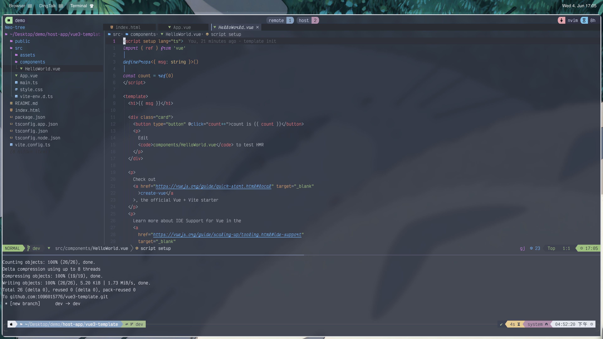

# My dotfile

## 

## env

os: macos + aerospace<br>
dev: yazi + lazyvim + lazygit<br>
font: [JetBrainsMono](https://www.nerdfonts.com/font-downloads)

## network etc

```shell
# archlinux change mirror or use proxy
Server = https://mirrors.tuna.tsinghua.edu.cn/archlinux/$repo/os/$arch
Server = https://mirrors.ustc.edu.cn/archlinux/$repo/os/$arch
Server = https://mirrors.huaweicloud.com/archlinux/$repo/os/$arch
```

## dep

```shell
# update arch key
pacman -Syyu
pacman-key --init
pacman-key --populate
pacman -Syy archlinux-keyring
# depancy install in macos or archlinux
bash bin/common/depancy.sh
```

## windows register

download [windows](https://github.com/massgravel/Microsoft-Activation-Scripts) version<br>
download [wsl-vpn](https://github.com/sakai135/wsl-vpnkit)

## resource

my wallpaper and windows-terminal config

## tip

I have a mklinks zsh to move dotfile<br>

### search text

```shell
grep -rh '<el-'|awk -F el- '{print $2}'|awk -F ' ' '{print$1}'|sort|uniq
defaults write com.apple.finder CreateDesktop -bool FALSE; killall Finder
```

